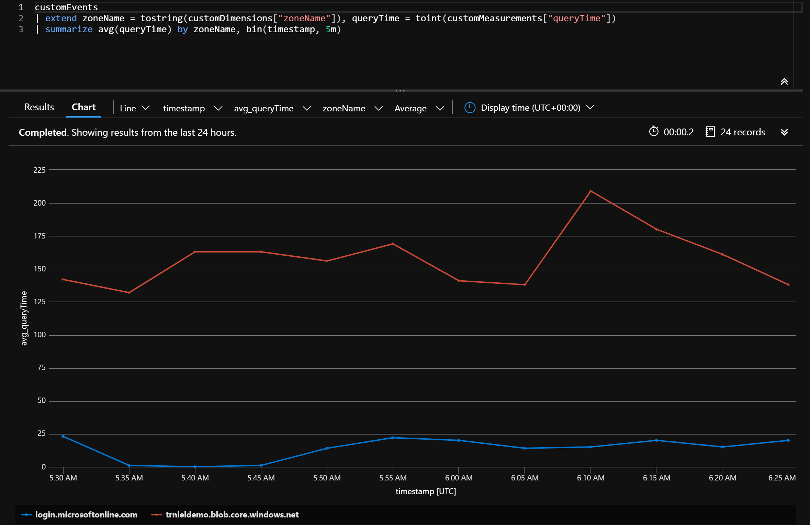

# DNS Performance Reporting

This is a sample Azure Function that reports query time in milliseconds for one or more DNS records. Query performance data is sent to Azure Application Insights for analysis.



## Configuration

Create Node JS Azure Function App. Ensure Application Insights is enabled as this will be used to capture DNS performance telelmetry. In the Function App, configure the following Application Settings:

* `DNS_ZONES`: Comma-separated list of DNS A records
* `CLOUDROLE_NAME`: Name of the Function App to be displayed in Application Insights

By default, the timer trigger runs every 5 minutes.

## Deployment

From the `src` directory, run `func azure functionapp publish [your_functionapp_name]` to deploy the Function code to an exisitng Function App.

## Reporting

The Function App will submit custom telelmetry to Application Insights. From within the Logs section of Application Insights, you can create a chart to show DNS resolution performance with the following query:

```bash
customEvents 
| extend zoneName = tostring(customDimensions["zoneName"]), queryTime = toint(customMeasurements["queryTime"])
| summarize avg(queryTime) by zoneName, bin(timestamp, 5m)
```